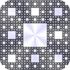
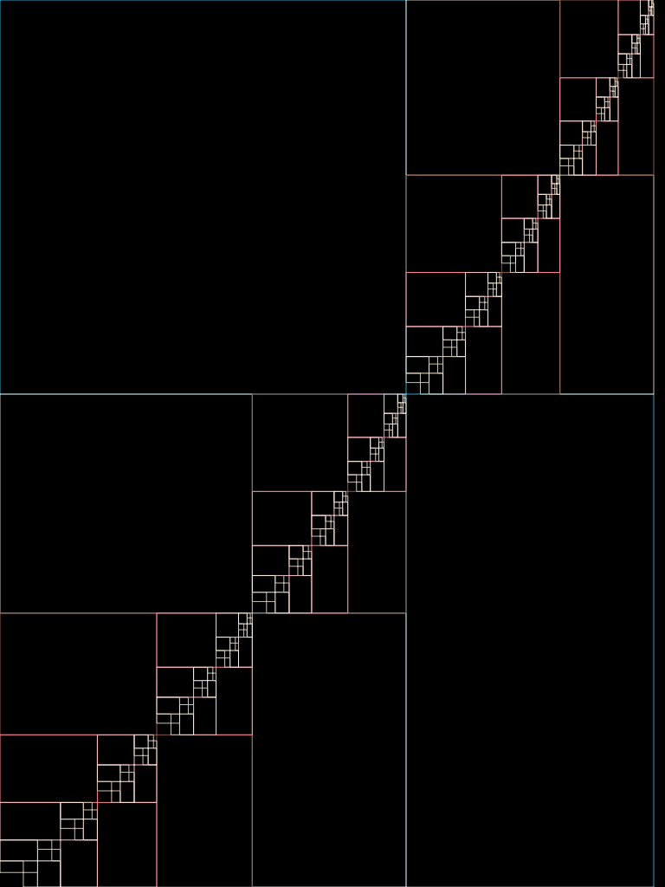
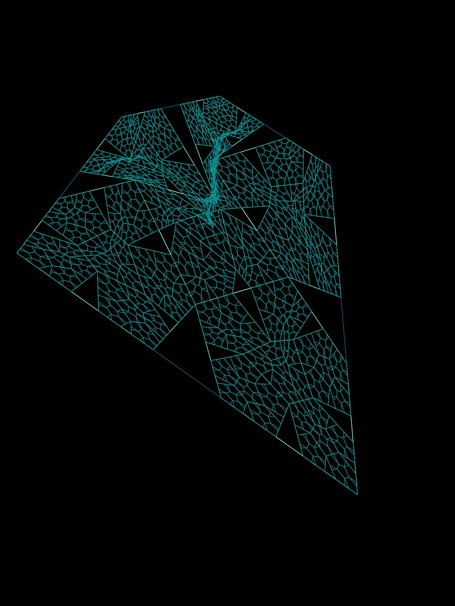
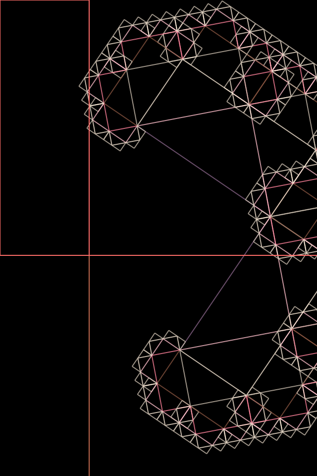

An iPad app to discover the art of recursive drawing through
touch. Use a different number of fingers while touching to draw
different recursive shapes, and watch them as they animate with pretty
colors. Change color themes by double-tapping. The major iOS
frameworks used here were Quartz2D and CoreAnimation.

[View on Github](https://github.com/ayanonagon/recursionapp)

# Multi-Finger Touch Responses

Depending on how many fingers you use to interact with the
application, a different recursive drawing will animate itself. Here's
an example of using one finger in the middle of the screen to
recursively draw these boxes within each other.

Here is an example with five fingers,

# Animation, Fade-in and out, Color Themes

Whenever a shape is drawn, it draws itself one recursive level at a
time, so you can see exactly how the recursion works to form the
complete image. You can double-tap to change between a variety of
built-in color themes.

Here's an example of using two fingers to draw a Levy.

