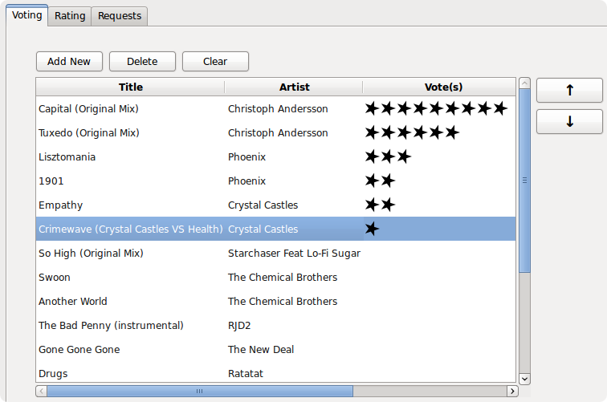

Android app that allows you to influence the party's music by voting
for upcoming songs and rating previously played songs. Created at
PennApps 2011. Won the "Greatest Potential" award.

The [DJ Feed website](djfeed)

[View on Github](https://github.com/emish/DJFeed)

# Android App

Now Playing let's you see what the DJ is playing right now and rate
it. Vote for upcoming songs to get what you want to hear. On auto, DJ
Feed will play songs with the highest votes within a playlist. Look
back at what was played last night with Previous Tracks.

[More Details](djfeed)

# PC Client

Import your current playlist and watch the stats. People's votes get
updated in real time, and the top songs pop up. Review what people
thought of songs you've already played. You can also choose to take
requests from the crowd.

[More Details](djfeed)
