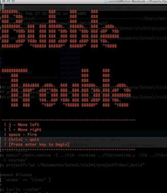

The Objects, Arrays, and Types programming language. Wrote the parser
and compiler with a buddy in OCaml, then we showcased it's greatness
in a little terminal game.

[View on Github](https://github.com/emish/Bubble-Trouble)

# Bubble Trouble

This game is written in our custom OAT language and compiled using the
compiler we built.

In this early childhood game, you have to pop all the bubbles using a
harpoon. Larger bubbles split into more bubbles that you have to take
care of too. The drawing is taken care of by ncurses, which is linked
to OAT as a C library.

