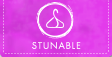
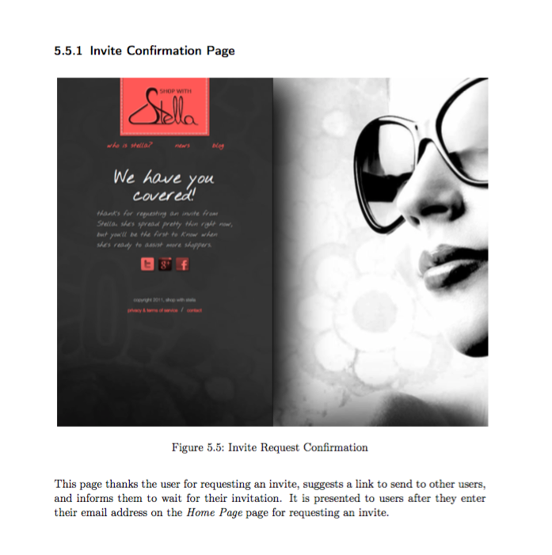

These projects reflect my past experiences managing products and
teams.

---

## San Francisco Go Club

Current president of the SF Go Club.

Established in 1935, the SF Go club is the oldest Go club in Northern
California. Our mission is to share, teach, promote, and enjoy the
game of Go together.

I manage club events, the website, member lists, employees,
etc... I'm constantly trying to improve the club offering and increase
our popularity.

[SF Go Club Website](http://sfgoclub.com)

---

## Stunable

Previously Shop with Stella, Stunable is ready to revolutionize the
way women experience fashion. Gone are the days of a hundred
thumbnails per page, replaced instead by a simple and social
recommendation interface.

The [Stunable web site](http://stunable.com)

[@stunable](https://twitter.com/stunable)

### Design Documents

[Preliminary design document](Functional_Specification_0.2.2.pdf)

[Final design document](Functional_Specification_Proper.pdf)

---

## Emacs Club

Rivals of Vim users unite! Just kidding, we love you guys too. But
seriously, Emacs is so awesome how could there not be a club? This
Penn group holds lectures and hack sessions on all topics emacs.

Definitely check out the meeting notes, they are engineer nerd gold.

[Official Emacs Club website](http://www.emacsclub.com/)

[Github page](https://github.com/emacsclub/emacsclub.github.com)

---

## B.A.R.D.

Botnet Atom Realtime Detector, an active distributed firewall whose
primary purpose is to detect and protect against botnet attacks and
infiltration. This is done by analyzing network flow information for
patterns common to botnet behaviors and attacks, and uses a particular
packet trait known as 'persistence'. This was a group-based project,
and you can find lots more details in the design document.

[Design Document](bard_design_doc.pdf)

---

## BAPCO Carbon-Credit Project

The Challenge: “Identify and Evaluate Carbon Credit Opportunities to
Improve the Environmental Impact of the Bahrain Petroleum Company”

Part of the "Action Learning Program," a two month program that teams
up Crown Prince International Scholarship students with delegates of
major companies in Bahrain to work on a real challenge.

The Action Learning team balances between improving the behaviour and
skills of its members while producing results. This program began with
a month long induction period that built leadership, management, and
networking skills.

After two months of research and work, this culminated in a proposal
and report.

[Project Proposal & Report](Final Report.pdf)

This final presentation was presented multiple times, to members of
all companies, including their board members and CEOs, as well as to
the top 100 managers and board of directors of BAPCO.

[Project Final Presentation](Final Bapco Internship Project.pdf)

---
