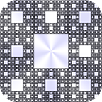
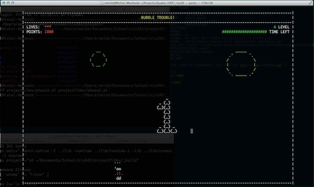

Here are some software projects that I'm particularly proud of.

---

## Art of Recursion

An iPad/iPhone app to discover the art of recursive drawing through
touch. Use a different number of fingers while touching to draw
different recursive shapes, and watch them as they animate with pretty
colors. Change color themes by double-tapping. The major iOS
frameworks used here were Quartz2D and CoreAnimation.

[View on Github](https://github.com/ayanonagon/recursionapp)

### Multi-Finger Touch Responses

Depending on how many fingers you use to interact with the
application, a different recursive drawing will animate itself. Here's
an example of using one finger in the middle of the screen to
recursively draw these boxes within each other.

Here is an example with five fingers,

### Animation, Fade-in and out, Color Themes

Whenever a shape is drawn, it draws itself one recursive level at a
time, so you can see exactly how the recursion works to form the
complete image. You can double-tap to change between a variety of
built-in color themes.

Here's an example of using two fingers to draw a Levy.

---

## DJ Feed

Android app that allows you to influence the party's music by voting
for upcoming songs and rating previously played songs. Created at
PennApps 2011. Won the "Greatest Potential" award.

The [DJ Feed website](djfeed)

[View on Github](https://github.com/emish/DJFeed)

### Android App

Now Playing let's you see what the DJ is playing right now and rate
it. Vote for upcoming songs to get what you want to hear. On auto, DJ
Feed will play songs with the highest votes within a playlist. Look
back at what was played last night with Previous Tracks.

[More Details](djfeed)

### PC Client

Import your current playlist and watch the stats. People's votes get
updated in real time, and the top songs pop up. Review what people
thought of songs you've already played. You can also choose to take
requests from the crowd.

[More Details](djfeed)

---

## Hearthbot

A Hearthstone playing robot that reads game logs to determine current
plays by opponent, and UI automation to control the mouse and play the
game via UI interaction.

Employs simple statistical models of game situations for determining
playing strategy, & a behavior fuzzing mechanism for avoiding bot
detection.

Never used in an unlawful manner, just for fun.

[View on Github](https://github.com/emish/hearthbot)

---

## OAT Compiler - Bubble Trouble Game

The Objects, Arrays, and Types programming language. Wrote the parser
and compiler with a buddy in OCaml, then we showcased it's greatness
in a little terminal game.

[View on Github](https://github.com/emish/Bubble-Trouble)

This game is written in our custom OAT language and built with the
compiler we created. 

In this early childhood game, you have to pop all the bubbles using a
harpoon. Larger bubbles split into more bubbles that you have to take
care of too. The drawing is taken care of by ncurses, which is linked
to OAT as a C library.

---

## LC4 Interpreter

An assembly language interpreter created in Haskell. LC4 is an
improved version of the known LC3 (Little Computer 3) language
developed at the University of Pennsylvania. We decided to create this
psuedo-debugger as a way for students first learning the language to
debug their assembly code.

[View on Github](https://github.com/emish/lc4sim)

---
